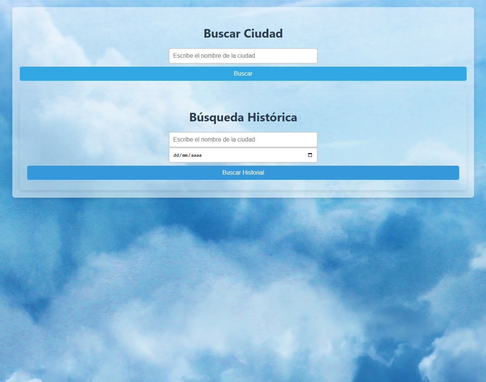
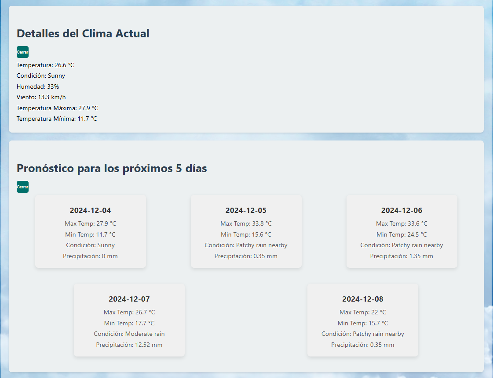
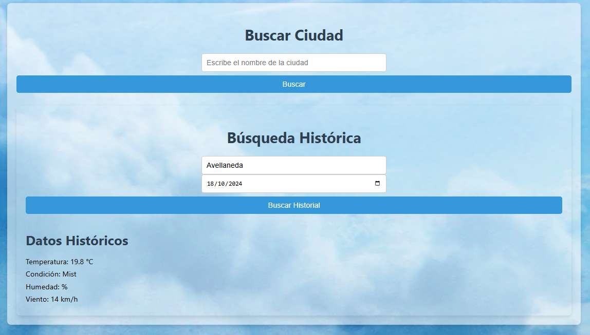

Simple app de clima, mostrando proyeccion a 5 dias entre otras cosas.

Se trata de crear una App que muestre los datos del clima utilizando la API del sitio web
MetaWeather.
La URL con la documentación de la API está en https://www.metaweather.com/api/
Puntos a desarrollar:
 Buscador de ciudades. Se debe implementar un buscador en forma de input de texto y
mostrar los resultados. O bien usar un campo tipo “auto-complete”, un combo o lo que el
candidato crea conveniente.
 Una vez seleccionada una ciudad, consultar los siguientes datos del día actual:
o Temperatura máxima y mínima
o Humedad
o Probabilidad de lluvias (predictability)
 Mostrar los datos de los próximos 5 días
Extras:
 La API soporta búsquedas históricas. Implementar un selector de fechas y efectuar esa
búsqueda y mostrar los resultados
o Tomar solamente el primer resultado obtenido (vienen varias predicciones con cada
request) y mostrar en pantalla los mismos datos del punto anterior.
 Como mejora, guardar en caché las consultas realizadas y devolverlas en caso de que ya
existan. La duración del caché es de 2 minutos (para simular su funcionamiento). Nota: no se
apunta a la utilización de la API de caché de los service workers, si no a implementar a mano
una solución sencilla.

# WeatherApp

This project was generated with [Angular CLI](https://github.com/angular/angular-cli) version 18.2.10.

## Development server

Run `ng serve` for a dev server. Navigate to `http://localhost:4200/`. The application will automatically reload if you change any of the source files.

## Code scaffolding

Run `ng generate component component-name` to generate a new component. You can also use `ng generate directive|pipe|service|class|guard|interface|enum|module`.

## Build

Run `ng build` to build the project. The build artifacts will be stored in the `dist/` directory.

## Running unit tests

Run `ng test` to execute the unit tests via [Karma](https://karma-runner.github.io).

## Running end-to-end tests

Run `ng e2e` to execute the end-to-end tests via a platform of your choice. To use this command, you need to first add a package that implements end-to-end testing capabilities.

## Further help

To get more help on the Angular CLI use `ng help` or go check out the [Angular CLI Overview and Command Reference](https://angular.dev/tools/cli) page.
